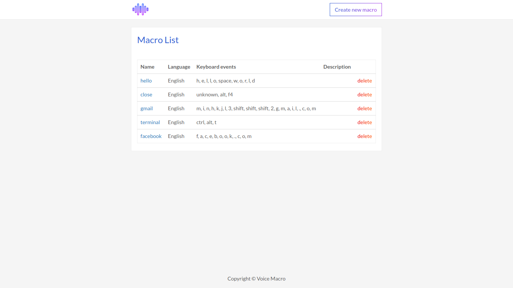
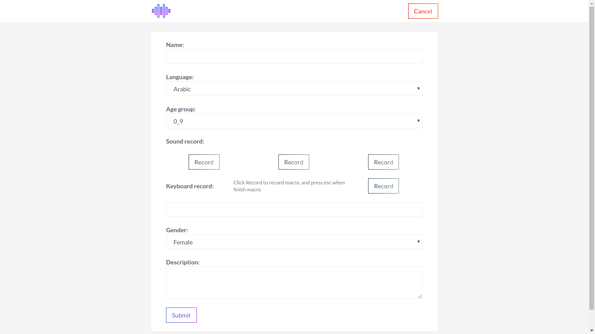
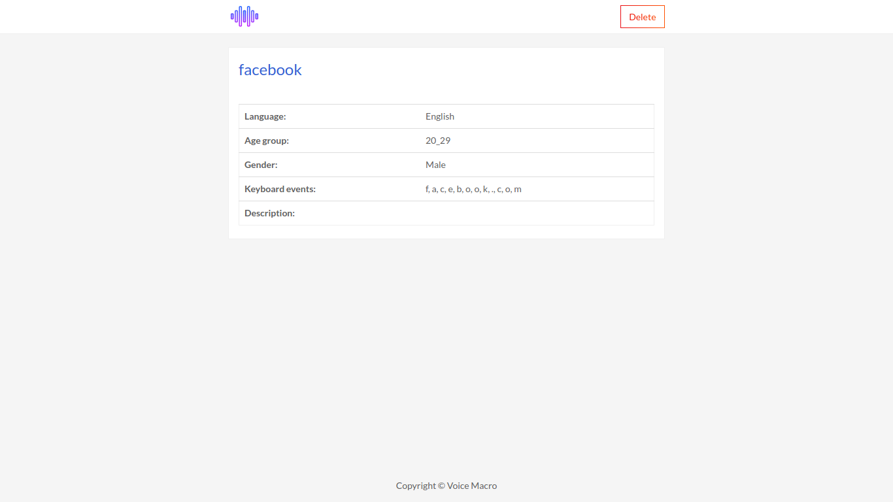

# Voice Macro
This is a keyboard macro program using voice command project, using `keyboard` and [`snowboy`](https://snowboy.kitt.ai/) package.



## Installation
Basic requirements:
- Python2.7
- Snowboy for python (check out their [github](https://github.com/kitt-ai/snowboy) for installation)

After compile snowboy, replace `snowboydetect.py` and `_snowboydetect.so` with your compiled version.

```bash
pip install -r requirements.txt
```

## Usage

### Running server
**Note:** The keyboard package need **root** permission to run.
```bash
sudo python server.py --port <your_port>
```
The server will be run at `localhost:<your_port>`. Ex: `sudo python server.py --port 8000` then the server will be running at `localhost:8000`.

### Manage macros
You will be able to manage your macros via web interface at `localhost:<your_port>`

| Home page | Create new macro | Macro Detail |
| :---: | :---: | :---: |
|  |  |  |

## Author
Minh Bui
Contact me via buicongminh2717@gmail.com


